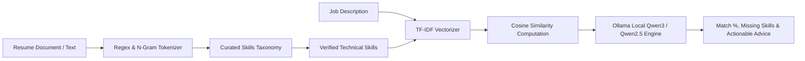

# CampusConnect — AI & NLP Microservice Architecture

The AI/NLP microservice provides semantic resume analysis, skill extraction, vector similarity matching, and qualitative candidate recommendations.

---

## 1. Pipeline Overview

---

## 2. Core Capabilities

### 1. Skill Extraction
- Normalizes technology keywords across programming languages, backend frameworks, cloud & DevOps tooling, databases, and computer science fundamentals.
- Employs negative lookaround token matching: `r'(?<![a-zA-Z0-9])' + re.escape(skill) + r'(?![a-zA-Z0-9])'`.
- Preserves accurate casing: `Spring Boot`, `FastAPI`, `MySQL`, `PostgreSQL`, `Node.js`, `DSA`, `AWS`.

### 2. Semantic Vector Similarity
- Computes Term Frequency-Inverse Document Frequency (TF-IDF) vectors from candidate profiles and job descriptions.
- Calculates Cosine Similarity between document vectors:
  $$\text{Cosine Similarity}(\vec{u}, \vec{v}) = \frac{\vec{u} \cdot \vec{v}}{\|\vec{u}\| \|\vec{v}\|}$$
- High resilience: gracefully handles sparse documents.

### 3. Local Ollama Qwen3 / Qwen2.5 Integration
- Communicates with Ollama running locally at `http://localhost:11434`.
- Model: `qwen2.5:latest` or `qwen3:8b` / `qwen3:14b`.
- Produces concise, non-hallucinatory recruitment recommendations.
- **Fail-Safe Mechanism**: If Ollama is offline or unavailable, automatically falls back to deterministic rule-based NLP templates with zero downtime.
