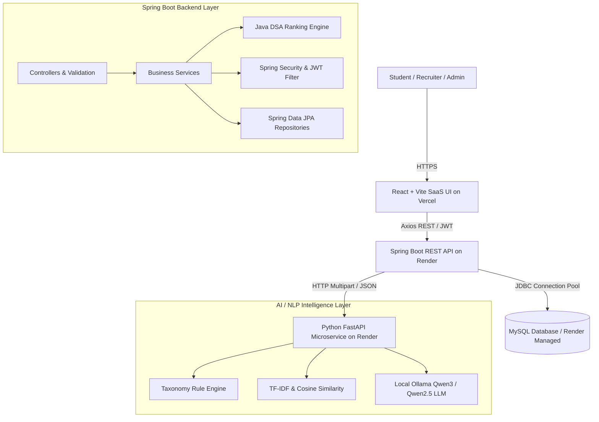

# CampusConnect — System Architecture Documentation

CampusConnect is an enterprise-grade AI-powered campus recruitment and placement platform. It features a polyglot microservice architecture designed for high scalability, explainable candidate evaluations, and seamless deployment across cloud providers.

---

## 1. High-Level Architecture Overview

---

## 2. Core Architectural Pillars

### Frontend (React + Vite)
- **Framework**: React 18 with Vite for instantaneous HMR and optimized tree-shaken production bundles.
- **Styling**: Tailwind CSS with custom glassmorphism, responsive breakpoints (Mobile, Tablet, Laptop, Desktop), and dark mode.
- **State & Communication**: Context API for JWT session persistence with Axios request/response interceptors.
- **Data Visualizations**: Recharts for application pipelines, candidate score distributions, and recruiter funnels.

### Backend (Spring Boot 3)
- **Framework**: Java 17, Spring Boot 3.2, Spring Data JPA, Spring Security 6.
- **Authentication**: Stateless HMAC-SHA256 JWT tokens with role-based access control (`ROLE_STUDENT`, `ROLE_RECRUITER`, `ROLE_ADMIN`).
- **Data Layer**: Clean DTO pattern preventing entity leaks, Hibernate ORM with MySQL/H2 dialect switching.
- **Exception Architecture**: `@RestControllerAdvice` global exception handler returning unified `ApiResponse<T>` schemas.

### AI / NLP Microservice (Python FastAPI)
- **Framework**: FastAPI with asynchronous endpoints and Pydantic v2 schemas.
- **Vector Matching**: Scikit-Learn TF-IDF vectorization and cosine similarity calculations.
- **Local LLM Integration**: Ollama API client communicating with Qwen3 / Qwen2.5 for qualitative recruitment recommendations with automatic heuristic fallbacks.

### DSA Ranking Engine
- **Max-Heap Algorithm**: Java `PriorityQueue<CandidateScoreDetails>` with custom multi-attribute `CandidateScoreComparator`.
- **Time Complexity**: $O(N \log K)$ ranking with $O(1)$ skill verification via `HashSet`.
- **Explainability**: Generates natural language breakdowns for every ranked candidate.
